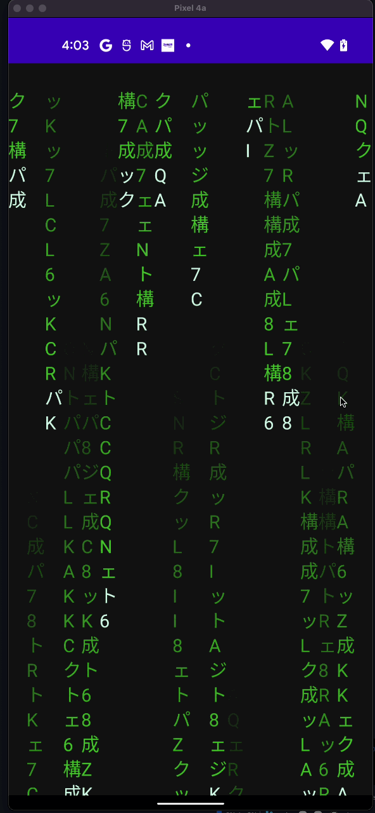

# MatrixRainCompose
Example from effect Rain Matrix with JetpackCompose

For more information, please [read the documentation](https://developer.android.com/jetpack/compose)

💻 Requirements
------------
To try out these sample app, you need to use [Android Studio Arctic Fox](https://developer.android.com/studio).
You can clone this repository or import the
project from Android Studio following the steps
[here](https://developer.android.com/jetpack/compose/setup#sample).

Preview
-----------
 

Credit to 

ApKelly from your Gist

https://gist.github.com/apkelly/c27bd3844f83ce7d3ecfe9804a613d84

And DevExperto for your videotutorial

https://www.youtube.com/watch?v=vUvjFnOoxcw
